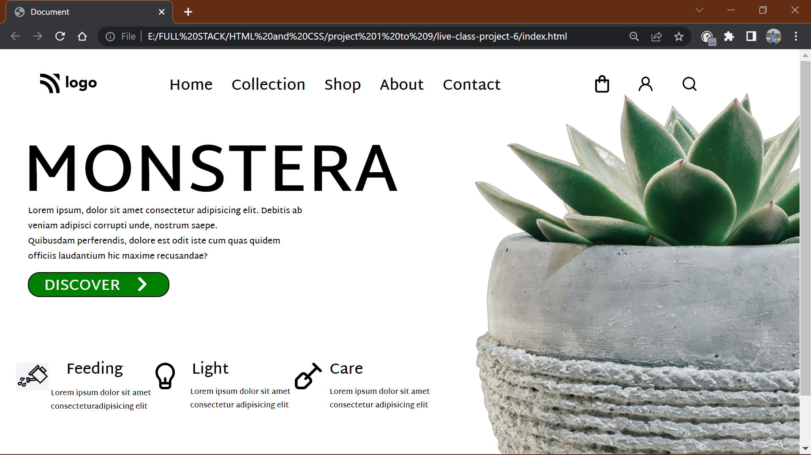

# ASSIGNMENT 6 USING HTML AND CSS

## NAME : NIRAJ VADHER 

In this project I was given the task to make a home page which should look like this

### Target:

### Result:

`ZOOM:67%`
## Learning
In this project i get to learn many thing like
- how to add hover effect and transition effect to any element
- how to effectively use position to create this decorative webpages
- how to edit the buttons and add css to them
- how to play with the images and how to resize the image in a better way
- how to add cards in the webpage and add `position` to them

## Honest Time of compeletion of project
- `6 hours`

## Live link of project
 - [PROJECT 6](https://tempproject6.netlify.app/)